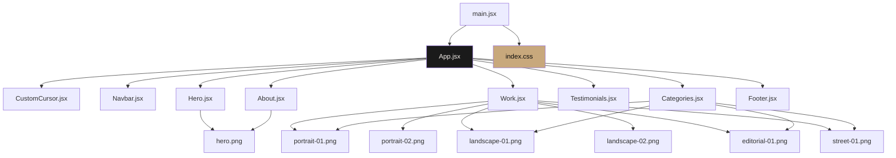

# MEMORY GRAPH — Photography Portfolio (React)

> **Purpose**: Single-file lookup for React components, Tailwind CSS v4 variables, assets, and Framer Motion triggers.
> Read this instead of scanning the codebase. Updated after every change.
>
> **Last Updated**: 2026-07-05

---

## Component Dependency Graph

---

## Tailwind CSS v4 Custom Theme (@theme)

| CSS Variable | Design Token | Tailwind Utility Class | Consumers |
|--------------|--------------|------------------------|-----------|
| `--color-cream` | `#F5F0EB` | `bg-cream` | body bg, CustomCursor, Testimonials, About |
| `--color-cream-dark` | `#E8E0D8` | `bg-cream-dark` | — |
| `--color-brand-black` | `#0A0A0A` | `bg-brand-black` | Work, Categories, Footer, Navbar scrolled |
| `--color-brand-accent` | `#C8A87C` | `bg-brand-accent` | tags active, cursor, buttons hover, category labels |
| `--font-heading` | Playfair Display, Georgia, serif | `font-heading` | All headings |
| `--font-body` | Inter, system-ui, sans-serif | `font-body` | Body text |

---

## React Component Registry

### CustomCursor.jsx
* **Responsibility**: Custom mouse follower dot & ring, snapping to interactive elements.
* **Framer Motion Elements**: `useMotionValue` (cursor coordinates), `useSpring` (smooth lag filter for ring).
* **Hover Hooks**: Detects `.project-card` to display "View", snaps size on links/buttons.

### Navbar.jsx
* **Responsibility**: Top navigation, toggles scroll background.
* **Scroll Hook**: Tracks `scrollY > 50` to toggle transparency vs glassmorphism overlay.

### Hero.jsx
* **Responsibility**: Splitted name introduction & photographer preview.
* **Framer Motion Elements**: Name reveal letters with stagger; `useScroll` + `useTransform` mapped to `scrollY` for subtle portrait image parallax.

### Work.jsx
* **Responsibility**: Filterable masonry style project grid.
* **React State**: `filter` ("all" | "portrait" | "landscape" | "editorial" | "street").
* **Framer Motion Elements**: `AnimatePresence` and `layout` prop for layout morphing.

### Categories.jsx
* **Responsibility**: Sticky-pinned horizontal scroll.
* **Framer Motion Elements**: `useScroll` target `containerRef` (parent of height `300vh`), `useTransform` maps `scrollYProgress` to horizontal translate `x` (`"0%"` to `"-60%"`).

### Testimonials.jsx
* **Responsibility**: Sticky-pinned testimonial card stack.
* **Framer Motion Elements**: `useScroll` target `containerRef` (parent of height `300vh`), each child maps its progress range `[start, end]` to `translateX` / `rotate` / `opacity` / `scale` depth offsets.

### About.jsx
* **Responsibility**: Biography details + stats metrics.
* **Framer Motion Elements**: `whileInView` reveals with scroll viewport threshold.

### Footer.jsx
* **Responsibility**: Contact call to action, social links, copyright.

---

## Assets Mapping (src/assets/images)

| Asset Name | Content | Dimension Style |
|------------|---------|-----------------|
| `hero.png` | Photographer portrait | Aspect cover |
| `portrait-01.png` | Golden hour portrait | Aspect 3/4 |
| `portrait-02.png` | weathered character portrait | Aspect 3/4 |
| `landscape-01.png` | sunset mountain view | Aspect 4/3 |
| `landscape-02.png` | long exposure seascape | Aspect 16/9 |
| `editorial-01.png` | fashion outfit model | Aspect 3/4 |
| `street-01.png` | neon rain city street | Aspect 4/3 |
